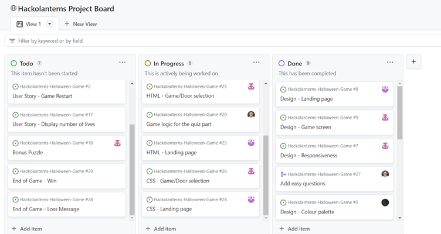

# Hackolanterns-Halloween
Halloween themed Hackathon - Quiz game with multiple choice answers to questions where you get to choose their
difficulty. Be sure to escape the haunted house ALIVE *evil-laugh-noises.mp3*.

ADD IMAGE

Visit the deployed site here: [Hackolanterns-Halloween](https://renaldas0.github.io/Hackolanterns-Halloween-Game/)

# Contents

- [Hackolanterns Halloween](#hackolanterns-halloween)
- [Contents](#contents)
- [Criteria](#criteria)
- [Overview](#overview)
- [Design](#design)
- [Responsiveness](#responsiveness)
- [Planning](#planning)
- [About Hackplanterns Halloween](#about-hackolanterns-halloween)
- [Introduction](#introduction)
- [Goal](#goal)
- [Problem Statement](#problem-statement)
- [Objectives](#objectives)
- [Target Audience](#target-audience)
- [Benefits](#benefits)
- [Tech](#tech)
- [Credits](#credits)

# Criteria

In this section, we will briefly discuss how our team addressed the applicable criteria:

## Overview

## Design

### Colour Scheme

Two seperate colour palettes have been used through this website. The first colour palette was used for the landing page
and is a range of blues:

These colours fit well with the night theme of the landing page and set the spooky tone.

The second colour palette we chose was four colours more traditionally associated with Halloween, to fit in with the
Halloween theme of this hackathon:

### Fonts

The fonts chosen were ...

TBC

### Wireframes

TBC - the version used to be added

## Responsiveness

The website was designed to be responsive on a range of devices:

ADD IMAGE FROM AM I RESPONSIVE

We considered only allowing the game to be played in landscape mode on smaller devices but, decided against this as we
thought it would impact the user experience and they may not want to play it if they had to take the extra step of
changing the view

## Planning

The project was planned through several huddles and messages through our Slack channel. A project board was produced for
team m emebers to have an overview of the project, to be able to assign tasks to team members and to be able to easily
see what tasks are yet to be started, are in progress, or have been completed

# About Hackathon Halloween

## Introduction

Hackthon Halloween is an interactive game where the player must go through a haunted mansion, keeping ahead of the angry
ghost by answering mutiple choice questions, PUZZLES AND RIDDLES (?) in order to escape!

## Goal

- To be responsive on a range of devices
- For there to be three different difficulty levels for the user to choose from
- The website to be intuative to use and easy to navigate
- The user to have an enjoyable game playing experience

### Problem Statement

There are simply not enough Halloween themed games where the user is being chased by an angry ghost!

### Objectives

- To produce a visually pleasing and fun to play game that players will want to play again and again

### Target Audience

This is a fun game to play for all users but is primarily geared towards adults (?? - depends on how hard the questions
are. TBC)

### Benefits

Entertains the user and improves their knowledge through answering the questions

# Tech

HTML, CSS, Bootstrap and JavaScript were used to create this website.

## Other Frameworks and Programs used

- Am I Responsive? To show the website image on a range of devices
- Codeanywhere – To write the code
- Github - To save and store files
- Google Dev Tools – Used to troubleshoot and debug
- Google Fonts - To import the fonts used on the website

# Credits

## Content

All content was written by team Hackolanterns

## Media

Photos and audio were taken from Pixabay and Upsplash

## Acknowledgements

We would like to acknowledge the following people for their help in completing our project:

- Sawyer and Kenan for arranging the Hackathon and hosting the welcome call
- Jaime Rodriguez and Alexis Maupin for judging the event
- All the facilitators for donating their time and experties. Especially Sean whom we had the pleasure of working with
